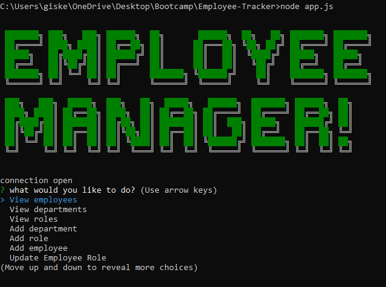
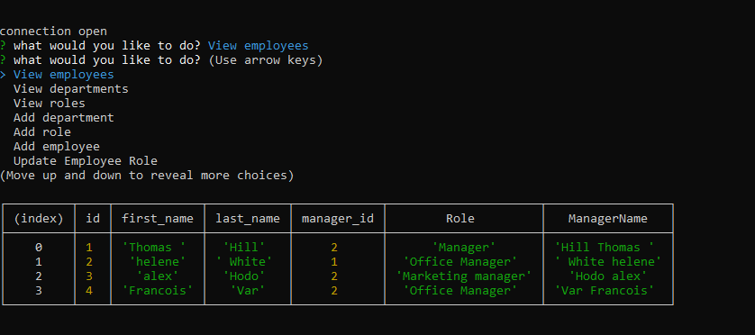
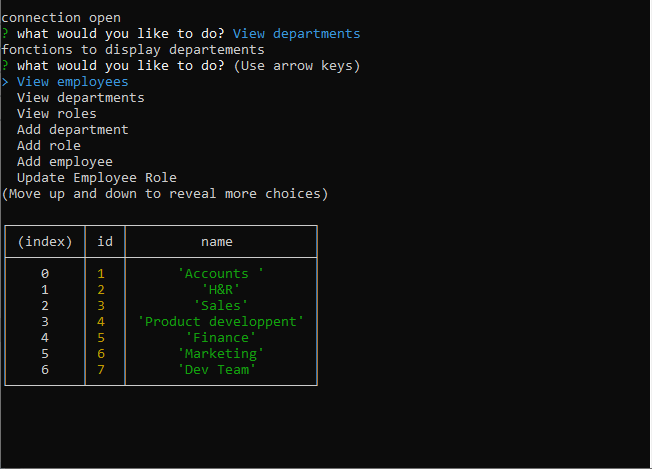

# Employee-Tracker

# Description
An app for managing a company's employees using node, inquirer, and MySQL.

The command-line application allow users to:
Add departments, roles, employees,
View departments, roles, employees
Update employee roles

# Technologies-Libraries
JavaScript, SQL, MySql, Node.js

# Screenshot

